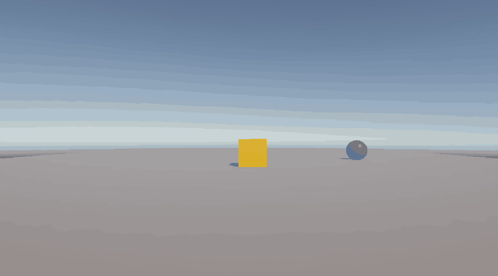
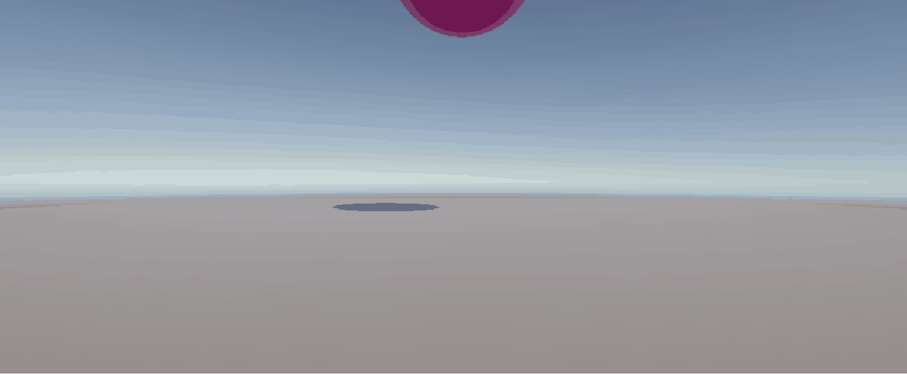

# Hier is wat is heb gemaakt 

# **1.2** 
Huis bouwen

Helaas is de huis die ik had gemaakt gecorrupt geworden dus ik kan hem helaas niet meer opstarten. 

# **2.2** 
Coin en een goumba
    > 

 Ronddraaiende coin en een heen en weer bewegende goumba.
 Coin script: https://github.com/SemDoeswijk93/Unity/blob/main/2.2/Assets/SimpleMovement.cs
 Goumba Script: https://github.com/SemDoeswijk93/Unity/blob/main/2.2/Assets/goumba.cs

# **3.1**
Stuiterende bal
    > 

Bal Script: https://github.com/SemDoeswijk93/Unity/blob/main/3.1/Assets/bounce.physicMaterial

Ja zoals de naam zegt, een bal de stuitert op de grond. 

$ **Concept**

Mijn concept van mijn spel is je hebt een baan waar je precies moet timen om de auto door de bocht te krijgen. Je krijgt 1 try en er zijn verschillende levels 

